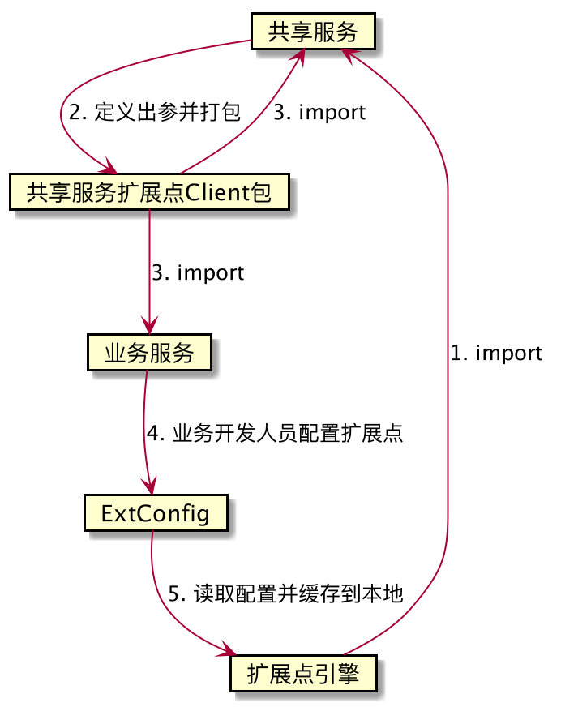

= Flighting 扩展点介绍
:lang: zh_CN
:toc:

"中台理念正在崛起，如果说2019年是中台技术的元年，作为一个不甘落后的新青年，还不赶紧上车？"
-- AngryApe

== 项目介绍
中台是什么:: 企业级 的 能力 复用 平台

共享服务经常需要根据不同业务自定义一些特殊的处理逻辑，此插件通过配置化的方式简化业务逻辑的扩展。

== 设计思路

``2``中建议共享服务方在每个类中作详细的注释，包括但不限于此扩展点的作用、每个属性的意义。

== 项目规划
,===
功能点, 时间, 状态

dubbo同步扩展点, 2020/01/20, 开发中
dubbo异步扩展点 **CompletableFuture**, 2020/01/30, 计划中
dubbo非阻塞扩展点 **RocketJs**, 期待 Dubbo 3.0 ing, 等待中
http扩展点, 2020/02/15, 计划中
http Reactor扩展点 **HttpClient**,  2020/02/29, 计划中
,===

== 模块说明

Lighting-console::
业务方配置，共享服务读取
lighting-client::
共享服务定义，业务方使用。 +
Client包中只有一个扩展点出参的接口，共享服务应自行定义继承自该包的Client包，以供业务服务引入。

+
.pom.xml
[source,xml]
----
<dependency>
    <groupId>com.ape</groupId>
    <artifactId>extension-highway-client</artifactId>
    <scope>provided</scope>
</dependency>
----

lighting-engine:: 共享服务使用
springboot-starter::
 * extension-highway-dubbo-starter
 * extension-highway-http-starter
 * extension-highway-function-starter
springboot-reactor-starter::
 * extension-highway-http-reactor-starter

TIP: 欢迎各位开发者贡献其他协议的扩展点。

== 使用方式
=== 共享服务
1. 引进engine包依赖
+
.pom.xml
[source,xml]
----
<dependency>
    <groupId>com.ape</groupId>
    <artifactId>extension-highway-engine</artifactId>
    <version>1.0.0</version>
</dependency>
----

2. 根据需要修改lighting-client工程(主要是扩展点出参的定义)，修改版本号，部署client包
3. 将版本号告知业务方
4. 在服务中引用lighting-client包

=== 业务扩展服务
. 引入client包依赖
+
.pom.xml
[source, xml]
----
<dependency>
    <groupId>com.ape</groupId>
    <artifactId>extension-highway-client</artifactId>
    <version>1.0.0</version>
</dependency>
----
. 定义扩展点接口并实现
. 在配置中心配置扩展点信息并发布

[NOTE]
====
扩展点配置发布后即时生效，引入lignting-engine的服务会收到配置并更新本地缓存。
====